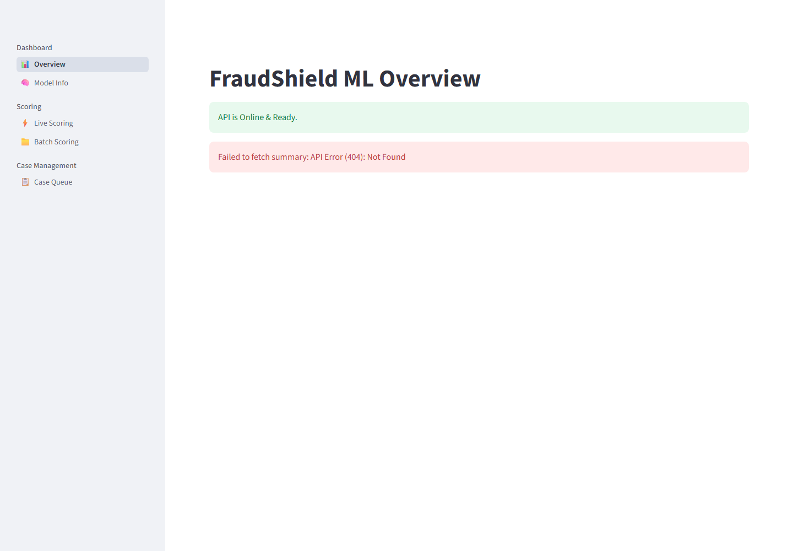
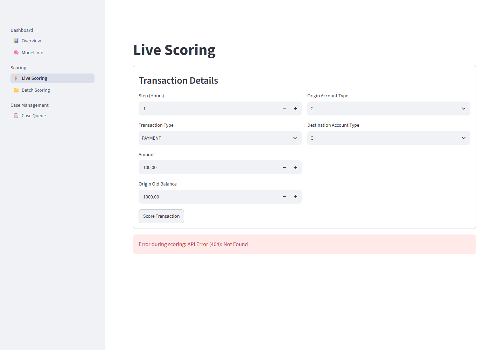
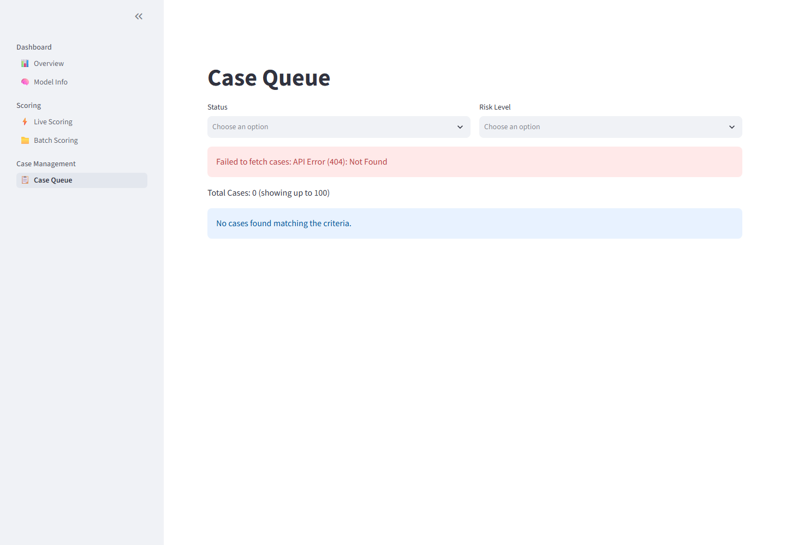
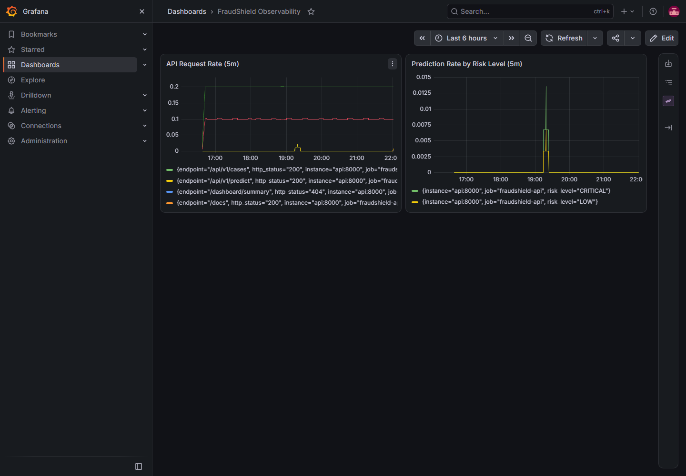
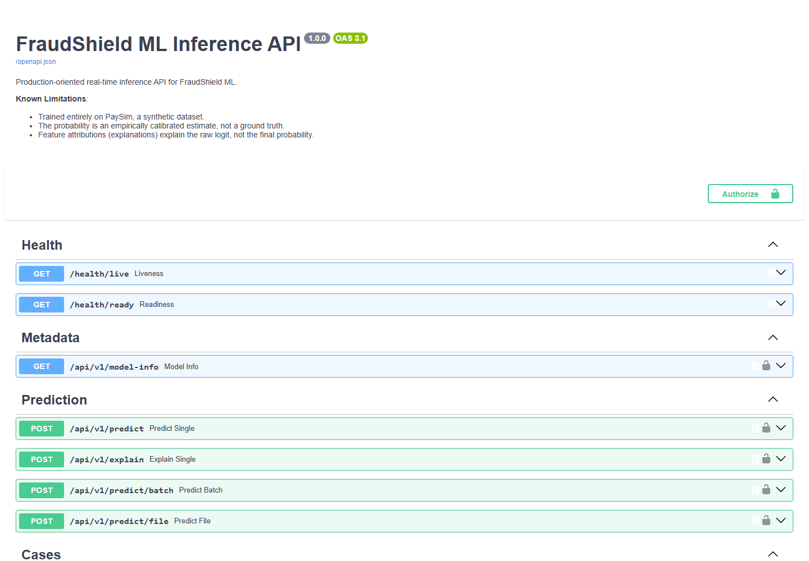
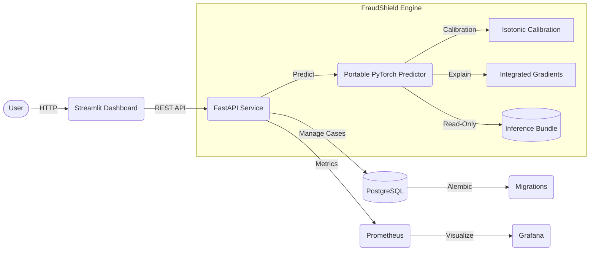

# FraudShield ML

FraudShield is an end-to-end fraud detection platform that combines point-in-time-safe machine learning, calibrated risk scoring, explainable inference, analyst case management, and observable API deployment.

## 1. Dashboard Overview

> 
> *Placeholder: A screenshot of the Streamlit analyst dashboard showing the case queue and synthetic transaction alerts.*

## 2. Key Outcomes
- **Responsible Model Selection**: Evaluated various architectures and rejected an artifact-dependent LightGBM model in favor of a strictly point-in-time-safe PyTorch MLP.
- **Explainability**: Integrated Gradients (Captum) assigns feature-level attribution and human-readable reason codes to every prediction.
- **Microservices Deployment**: Complete containerization with a FastAPI backend, Streamlit frontend, and PostgreSQL database, monitored through Prometheus and Grafana.

### Live Scoring & Explainability
> 
> 

### Case Management
> 

### Observability
> 
> 

## 3. Why the Model-Selection Process Matters
During Phase 4, our full engineered LightGBM achieved a PR-AUC of 1.0 on the PaySim dataset. However, a rigorous simulation audit revealed that this perfect score was dominated by dataset-specific balance-error artifacts. Rather than deploying an overfit, artifact-dependent model, it was explicitly rejected. The final deployed model uses only strictly **point-in-time-safe features**, serving as strong evidence of responsible MLOps and scientific integrity over vanity metrics.

## 4. System Architecture



## 5. Capabilities
- **Strictly Safe Inference**: No arbitrary Python execution (Scikit-Learn Pickled artifacts are fully extracted to pure NumPy/JSON representations).
- **FastAPI Backend**: Fully asynchronous, Pydantic-validated REST API.
- **PostgreSQL Case Management**: Immutable case events and analyst actions.
- **Observability**: Real-time Prometheus metrics exported to Grafana dashboards.

## 6. Quick Start with Docker

Start the entire environment locally in synthetic integration mode:

```bash
docker compose up -d --build
docker compose ps
```

*Note: Ensure the local environment variables are configured as shown in `docs/demo.md`.*

When finished, safely shut down without deleting data:
```bash
docker compose down
```

> [!WARNING]
> Running `docker compose down -v` will permanently delete your PostgreSQL case database volume!

## 7. Example API Request and Response

**Request:**
```bash
curl -X POST "http://127.0.0.1:8000/api/v1/predict" \
     -H "X-API-Key: test_key" \
     -H "Content-Type: application/json" \
     -d '{
           "step": 1,
           "type": "TRANSFER",
           "amount": 500000,
           "oldbalanceOrg": 500000,
           "orig_account_type": "C",
           "dest_account_type": "C"
         }'
```

**Response:**
```json
{
  "fraud_score": 2.14,
  "calibrated_probability": 0.89,
  "risk_level": "CRITICAL",
  "is_alert": true,
  "reason_codes": ["RC001", "RC002"]
}
```

## 8. Evaluation Results

Final point-in-time-safe PyTorch MLP results (on temporal holdout):

| Metric | Score |
|---|---|
| PR-AUC | 0.7442 |
| F1 Score | 0.5662 |
| Recall | 0.7574 |
| Precision | 0.4521 |
| Alerts per 1,000 tx | 7.31 |

> [!NOTE]
> The evaluation set had previously been used during the Phase 3 baseline analysis and therefore is not a pristine holdout set.

## 9. Testing and Security
- Over 50 unit and integration tests passing (`pytest tests/`).
- No sensitive keys, passwords, or datasets tracked in the repository.
- Docker containers run as `nonroot`.
- Inference bundle explicitly mounted as `ro` (read-only).

## 10. Repository Structure
```text
fraudshield-ml/
├── docs/                # Technical documentation and reports
├── examples/            # Synthetic API payloads
├── src/fraudshield/     # Core application source code
├── tests/               # Pytest suite
├── docker-compose.yml   # Multi-container orchestration
└── README.md            # This file
```

## 11. Documentation Links
See the complete [Documentation Index](docs/README.md) for detailed reports on data exploration, leakage auditing, architecture, and deployment.

## 12. Limitations
- Models are trained on the synthetic PaySim dataset and do not represent real-bank performance.
- Calibrated scores are statistical representations within the synthetic dataset, not real-world true fraud probabilities.
- Security configurations (API keys) are structured for a production-oriented portfolio and demonstration system, not enterprise banking integration.

## 13. Author and License Status
- **Author**: Efe Çiçekdağı
- **License**: MIT License (See `LICENSE` file for details).
