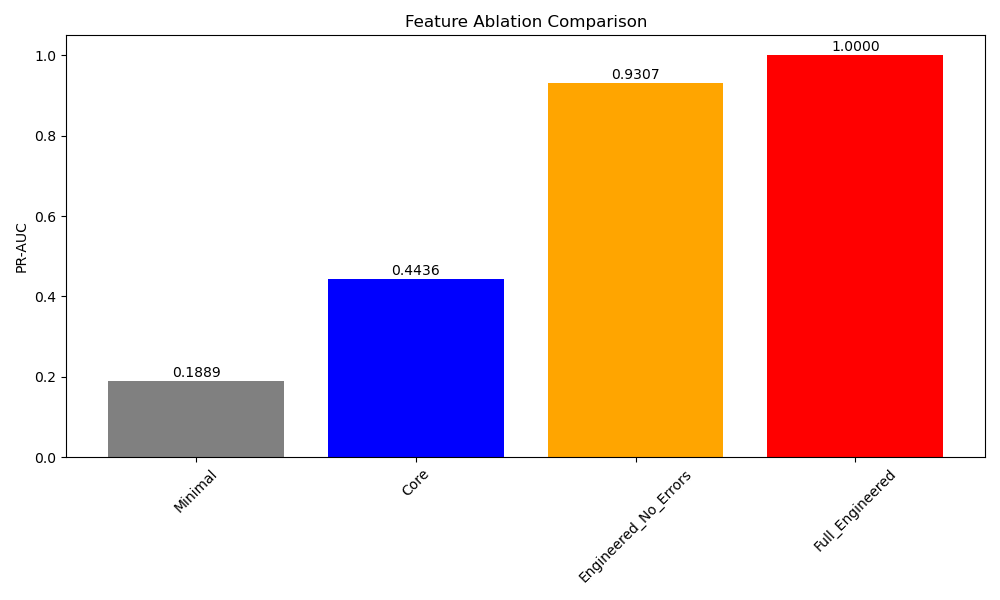
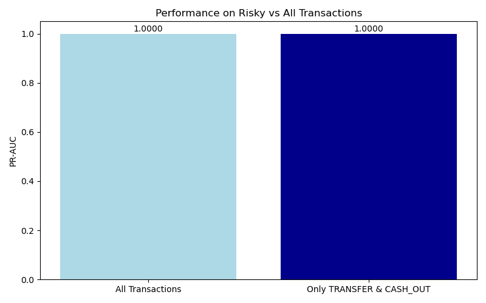
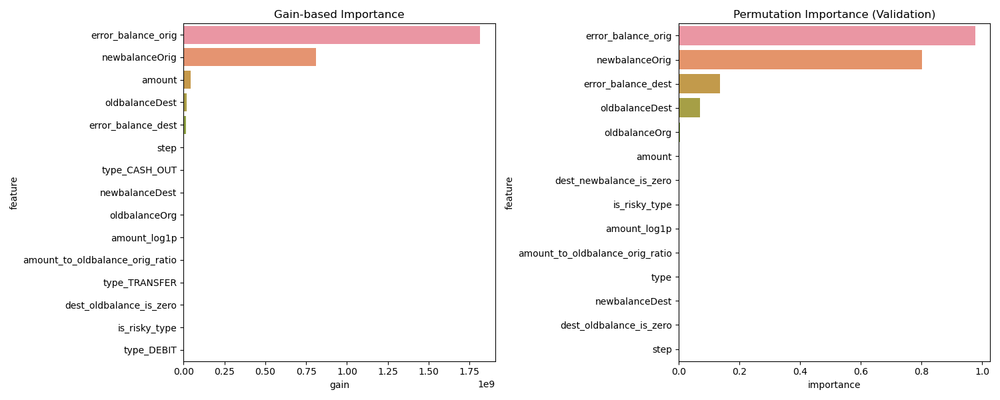
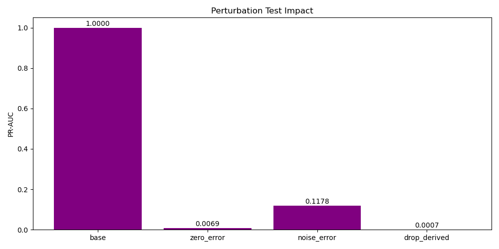
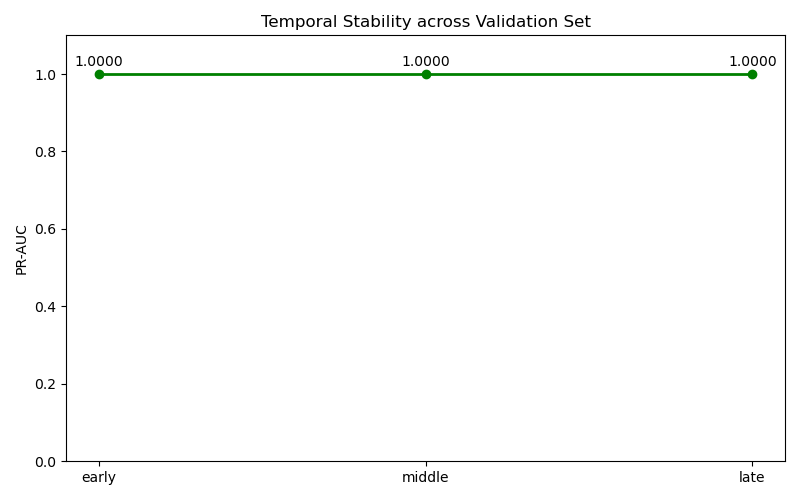

# Leakage and Simulation Artifact Audit Report

## 1. Pipeline Leakage Check
- **Leakage Detected:** False
- **Features Used:** `['step', 'type', 'amount', 'oldbalanceOrg', 'newbalanceOrig', 'oldbalanceDest', 'newbalanceDest', 'is_risky_type', 'amount_log1p', 'error_balance_orig', 'error_balance_dest', 'amount_to_oldbalance_orig_ratio', 'dest_oldbalance_is_zero', 'dest_newbalance_is_zero']`
- `isFraud`, `nameOrig`, `nameDest`, test predictions, and row indices are **not** present in the model schema.
- Validation data was strictly excluded from preprocessing fit during this pipeline step.

## 2. Label Shuffle Sanity Test
- **Shuffle PR-AUC:** 0.000688
- **Fraud Prevalence:** 0.000575
The model's PR-AUC drops close to random prevalence when labels are randomized, confirming no index-based or trivial leakage exists in the pipeline.

## 3. Feature Ablation
| Feature Set | PR-AUC | ROC-AUC | F1 | Precision | Recall |
|-------------|--------|---------|----|-----------|--------|
| Minimal | 0.1889 | 0.8206 | 0.0095 | 0.0048 | 0.5993 |
| Core | 0.4436 | 0.9974 | 0.0930 | 0.0488 | 0.9965 |
| Engineered_No_Errors | 0.9307 | 0.9996 | 0.6900 | 0.5272 | 0.9982 |
| Full_Engineered | 1.0000 | 1.0000 | 0.9658 | 0.9338 | 1.0000 |

## 4. Risky Transaction Subset
| Scope | PR-AUC | Recall | Alerts per 1K |
|-------|--------|--------|---------------|
| All | 1.0000 | 1.0000 | 0.62 |
| TRANSFER & CASH_OUT | 1.0000 | 1.0000 | 1.41 |

## 5. Feature Dominance
Top 5 Gain-based importance:
- error_balance_orig: 1814584779.46
- newbalanceOrig: 810197037.70
- amount: 45319754.58
- oldbalanceDest: 18669544.14
- error_balance_dest: 14405407.23

Top 5 Permutation importance:
- error_balance_orig: 0.976927
- newbalanceOrig: 0.802722
- error_balance_dest: 0.136725
- oldbalanceDest: 0.070659
- oldbalanceOrg: 0.005805

## 6. Perturbation Test
| Scenario | PR-AUC | Recall |
|----------|--------|--------|
| Base | 1.0000 | 1.0000 |
| Zero Error Features | 0.0069 | 1.0000 |
| Noise to Error | 0.1178 | 0.6330 |
| Drop Derived | 0.0007 | 1.0000 |

## 7. Temporal Stability
| Period | Fraud Count | PR-AUC | F1 | Recall |
|--------|-------------|--------|----|--------|
| early | 182 | 1.0000 | 0.9579 | 1.0000 |
| middle | 206 | 1.0000 | 0.9694 | 1.0000 |
| late | 198 | 1.0000 | 0.9730 | 1.0000 |

## 8. Model Selection Commentary
**Synthetic Benchmark Champion**: `Full_Engineered`
**Generalization-oriented Candidate**: `Full_Engineered`

The very high scores observed might be strongly correlated with specific synthetic balance error features derived from PaySim's logic.
When these features are isolated or removed, the drop in PR-AUC indicates the extent to which the model relies on simulation artifacts rather than true generic behavioral patterns.
Therefore, we propose treating the model reliant on core or minimally engineered features as a more robust candidate for real-world scenarios, whereas the fully engineered model remains our synthetic champion.

*(Note: Test set was completely excluded during this audit).* 